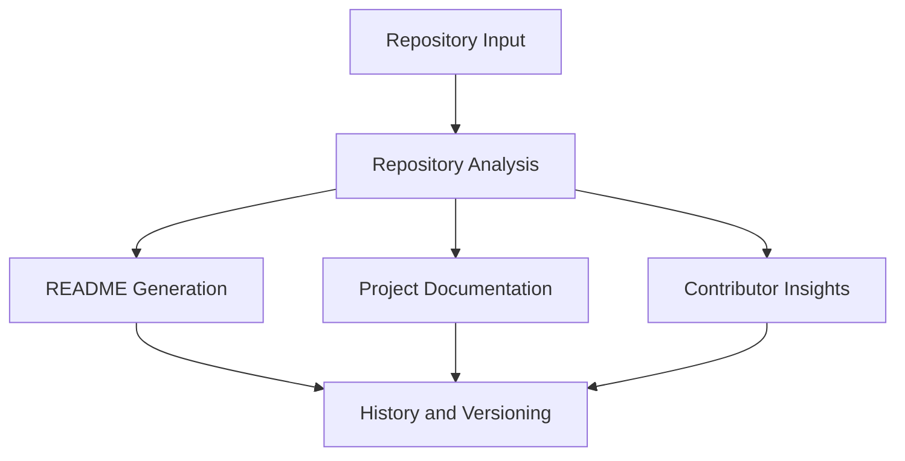

# Project Overview Report: 22A91A6194/CLOUD-NATIVE-EXPENSE-TRACKER-WITH-CI-CD

## 1. Project Overview
### Problem Statement
This repository addresses a software delivery or product need represented by its source code and module structure.

### Objective
Provide maintainable implementation and clear development workflows for contributors and maintainers.

## 2. Key Features
- Core repository workflows inferred from source structure and build scripts.
- Reusable components and module-level organization.
- Collaboration support through issue and pull-request based iteration.

### Business Value
- Reduces onboarding time through clear technical organization.
- Improves reliability through explicit tooling and dependency definitions.
- Supports scalable contribution patterns.

## 3. Technical Stack
- Languages: JavaScript (97.31%), CSS (2.33%), HTML (0.36%)
- Frameworks: Vite
- Libraries/Tools: package-lock.json, package.json, vite.config.js


## Architecture Overview

## 4. Development Summary
- Repository size: 11501 KB
- Default branch: main
- Open issues: 0
- Active modules snapshot:
```text
+ Backend
  - .env
  + config
    - db.js
  + controllers
    - authController.js
    - dashboardController.js
    - expenseController.js
    - incomeController.js
  - expense_details.xlsx
  - income_details.xlsx
  + middleware
    - authMiddleware.js
    - uploadMiddleware.js
  + models
    - Expense.js
    - Income.js
    - User.js
  + node_modules
    + .bin
    - .package-lock.json
    + @mongodb-js
    + @types
    + accepts
    + adler-32
    + anymatch
    + append-field
    + balanced-match
    + bcryptjs
    + binary-extensions
    + body-parser
    + brace-expansion
    + braces
    + bson
    + buffer-equal-constant-time
    + buffer-from
    + busboy
    + bytes
    + call-bind-apply-helpers
    + call-bound
    ...
  ...
...
```

## 5. Notes
No repository description provided.
